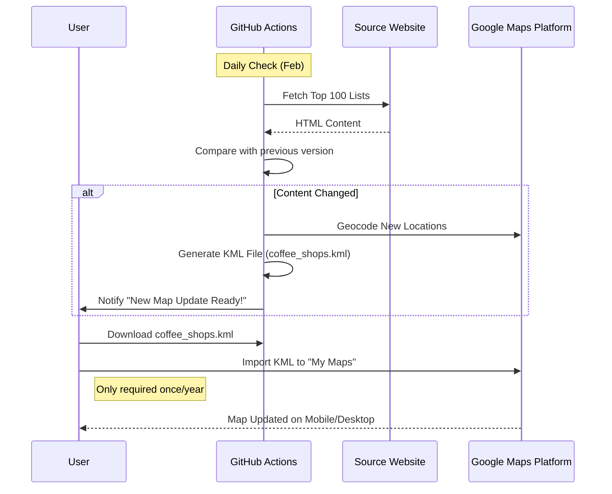

# Product Requirement Document (PRD): Coffee Map Auto-Sync

## 1. Executive Summary
The **Coffee Map Auto-Sync** is a personal automation tool designed to create and maintain a Google Maps "Top 100 Best Coffee Shops" list. It monitors a specific source URL for the annual release of the top coffee shops list, extracts the location data, and updates a user's Google Map list/layer. The system is designed to run with **zero maintenance costs** by utilizing free tier resources (GitHub Actions/PythonAnywhere, Google Maps Free Tier).

## 2. Problem Statement
Coffee enthusiasts want to visit the "Top 100 Best Coffee Shops" but the list is published as a static website or a shared map that doesn't integrate natively into their "Your Places" or allow for easy filtering/tracking on mobile. Users want a copy of this map in their own account that stays updated when the rankings change (annually).

## 3. Goals & Success Metrics
- **Automated Extraction**: Successfully scrape/parse coffee shop names and locations from the source.
- **Google Maps Integration**: Automatically add/update these locations in a Google Maps List or My Map.
- **Zero Cost**: Architecture must run entirely within free tiers of all services.
- **Timeliness**: System must capture the annual update (specifically around Feb 16) within 24 hours of release.

## 4. Functional Requirements

### 4.1 Data Source Monitoring
- **Sources**:
    - **Main List**: `https://theworlds100bestcoffeeshops.com/top-100-coffee-shops/`
    - **Secondary List (South)**: `https://theworlds100bestcoffeeshops.com/top-100-coffee-shops-south/`
    - **Secondary Source (Reference/Backup)**: `https://www.atlantacoffeeshops.com/the-worlds-100-best-coffee-shops` (Unofficial blog, useful for visual verification or backup if main site is down)
- **Frequency**:
    - Low frequency check (e.g., Weekly) during off-season.
    - High frequency check (Daily) during February (Target Update: Feb 16).
    - *Update:* User confirmed next update is Feb 16.
- **Trigger**: Change in content/list version.

### 4.2 Data Extraction
- **Input**: HTML content of the source page or underlying KML/JSON if available.
- **Processing**:
    - Extract Name, Address, City, Country, Rank (if available).
    - Geocode address to Lat/Long (if not provided).

### 4.3 Google Maps Sync
- **Target**: Google Maps Account.
- **Mechanism**:
    - *Option A (Preferred for Mobile Experience)*: **Google Places API** to add items to a "Saved List" (e.g., "Want to Go" or custom list).
    - *Option B (backup)*: **Google My Maps (KML Import)**. *Note: My Maps API is deprecated/limited; this might require generating a KML file for manual upload if automation is blocked, but we will attempt Places API first.*
- **Action**: Add new locations; Remove dropped locations (optional/user config).

## 5. Technical Architecture (The "Zero Cost" Stack)

### 5.1 Infrastructure
- **Compute**: GitHub Actions.
    - Why: 2,000 free minutes/month is more than enough for a script that runs a few times a month.
    - Scheduler: Cron trigger in GitHub Actions workflow (e.g., `0 9 * 2 *` for daily checks in Feb).
- **Database**: Flat file (JSON) stored in the Git repository.
    - State: `data/current_list.json`.

### 5.2 External APIs
- **Google Maps Platform**:
    - **Places API**: To find Place IDs for coffee shops.
    - **Maps API**: To manage the list (if APIs allow write access).
    - *Constraint*: Must strictly safeguard the API Key in GitHub Secrets.

### 5.3 Logic Flow
1. **GitHub Action** triggers on schedule.
2. **Python Script** fetches source URL.
3. Parses list.
4. Compares with `data/current_list.json`.
5. If difference found:
    - Authenticate with Google (OAuth/Service Account).
    - For each new shop: Search Place ID -> Add to List.
    - Update `data/current_list.json`.
    - Commit changes to repo (keeping history).
6. **Notify**: Send email or create Issue upon update.

## 6. Constraints & Risks
- **Google Maps API Writes**: The API for *creating* and *modifying* user listsProgrammatically is restricted and often requires personal OAuth tokens which expire.
    - *Mitigation*: If full automation of "Saved Lists" is blocked by API permissions, the fallback is generating a .CSV/.KML file that the user can import into "My Maps" in one click.
- **Scraping Reliability**: Source site DOM changes could break the scraper.
    - *Mitigation*: Robust error handling and "Need Help" notification.

## 7. Timeline / Roadmap
- **Phase 1 (Setup)**: Repo setup, API Key generation, basic scraper.
- **Phase 2 (Core)**: Geocoding and List generation (KML/CSV output).
- **Phase 3 (Optimization)**: Direct API integration (if feasible) or optimized manual import flow.
- **Phase 4 (Automation)**: GitHub Actions scheduler set for Feb.

## 8. User Workflow Diagram

