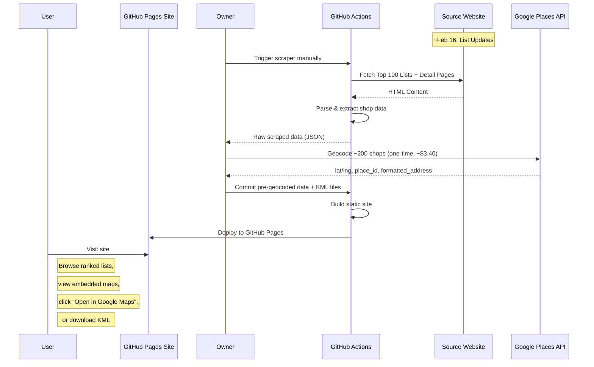

# Product Requirement Document (PRD): Coffee Map Auto-Sync

## 1. Executive Summary
The **Coffee Map Auto-Sync** is an open-source tool that scrapes the annual "Top 100 Best Coffee Shops" list, geocodes the locations (once per year, by the project owner), and publishes a **polished static website** hosted on GitHub Pages. The site features embedded Google My Maps, ranked lists with direct "Open in Google Maps" links, and KML downloads for power users. The system is designed to run with **zero cost for end users** — no API keys required.

## 2. Problem Statement
Coffee enthusiasts want to explore the "Top 100 Best Coffee Shops" but the list is published as a static website that doesn't integrate natively into Google Maps or allow for easy filtering/tracking on mobile. Users want a beautiful, browsable map with direct links to navigate to each shop — without needing API keys or technical setup.

## 3. Goals & Success Metrics
- **Automated Extraction**: Successfully scrape/parse coffee shop names and locations from the source.
- **One-Time Geocoding**: Owner geocodes ~200 shops once per year (~$3.40, covered by Google free tier). Pre-geocoded data (lat/lng, place_id) is committed to the repo.
- **Static Site on GitHub Pages**: A polished one-pager with editorial feel — highlights the Madrid ceremony and award prestige.
- **Zero Cost for Users**: Open-source users never need an API key. All data is pre-geocoded and committed.
- **Timeliness**: System captures the annual update (around Feb 16) within 3-4 days of release. Ship ~Feb 21.

## 4. Functional Requirements

### 4.1 Data Source Monitoring
- **Sources**:
    - **Main List**: `https://theworlds100bestcoffeeshops.com/top-100-coffee-shops/`
    - **Secondary List (South America)**: `https://theworlds100bestcoffeeshops.com/top-100-coffee-shops-south/`
- **Scraping Approach**:
    - Site is static HTML (WordPress + Elementor), BeautifulSoup works.
    - No pagination — all 100 shops on one page per list.
    - City data may only exist on individual detail pages — scraper must visit detail pages.
- **Timeline**: Wait for list to update on ~Feb 16, then scrape real 2026 data.

### 4.2 Data Extraction
- **Input**: HTML content of the source pages + individual detail pages.
- **Processing**:
    - Extract Name, City, Country, Rank, Detail URL from list pages.
    - Visit detail pages to extract full address and city.
    - Geocode using Google Places API (owner-only, one-time per year).
    - Pre-geocoded data (lat, lng, place_id, formatted_address) committed to repo.

### 4.3 Static Site (GitHub Pages)
- **Two sections**: Main Top 100 + South America Top 100.
- **Each section includes**:
    - Embedded Google My Maps iframe (interactive map).
    - Ranked list with direct "Open in Google Maps" links (uses `google.com/maps/search/` URLs — no API needed).
    - KML download button for power users.
- **Design**: Editorial feel — highlight the Madrid ceremony, award prestige, not just a data dump.
- **No API key required for users**: All map links use public Google Maps search URLs.

### 4.4 KML Generation
- Generate KML files for Google My Maps import.
- Two folders/layers: "Top 100" and "Top 100 South America".
- Styled pins (rank 1-10 get a star, others a dot).

## 5. Technical Architecture (The "Zero Cost" Stack)

### 5.1 Infrastructure
- **Compute**: GitHub Actions for scraping and site builds.
- **Hosting**: GitHub Pages for the static site.
- **Database**: Flat files (JSON) stored in the Git repository.
    - `data/raw_coffee_shops.json` — raw scraped data (name, rank, country, city, address, detail_url).
    - `data/current_list.json` — pre-geocoded shop data with lat/lng/place_id (committed to repo).

### 5.2 External APIs (Owner-Only)
- **Google Places API** (owner's key only, never exposed):
    - Used once per year to geocode ~200 shops.
    - Cost: ~$3.40, covered by Google's $200/month free tier.
    - API key stored in owner's local `.env` via `python-dotenv` — never committed.
- **No API key required for end users**.

### 5.3 Key Libraries
- `requests` + `beautifulsoup4` + `lxml` — scraping and HTML parsing.
- `python-dotenv` — `.env` file loading for API key (owner-only).
- `simplekml` — KML file generation with styled pins.
- `jinja2` — HTML templating for static site generation.
- `pytest` — test framework.

### 5.4 Logic Flow
1. **Scraper** (`src/scraper.py`) fetches source URLs, parses lists via grouped `<a>` tags, visits detail pages for city/address.
2. **Geocoder** (`src/geocoder.py`, owner-only) enriches data with lat/lng/place_id via Google Places API Text Search. Caches by (name, category), caps at 250 API calls.
3. **KML Generator** (`src/generator.py`) produces two KML files with styled pins (star for top 10, dot for rest).
4. **Site Builder** (`src/site_builder.py` + `src/templates.py`) generates a polished Jinja2-templated HTML site with ranked lists and "Open in Google Maps" links.
5. **Orchestrator** (`src/main.py`) wires all modules with CLI modes: `scrape-only`, `geocode`, `build-site`, `full`.
6. **GitHub Actions** automates scraping, site building, and deployment to GitHub Pages.
7. Pre-geocoded data and KML files are committed to the repo for open-source access.

## 6. Constraints & Risks
- **No User-Facing API**: Google Places API is only used by the project owner for geocoding. Users interact with the static site and public Google Maps URLs only.
- **Scraping Reliability**: Source site DOM changes could break the scraper.
    - *Mitigation*: Robust error handling and notification on failure.
- **City Data on Detail Pages**: City info may only be available on individual shop pages, requiring extra requests.
    - *Mitigation*: Discovery prompt to validate selectors before full scrape.
- **Google My Maps Iframes**: Embedded maps require a published My Maps layer (created once per year by the owner).

## 7. Timeline / Roadmap
- **Phase 1 (Scraper)**: COMPLETE. Scraper validated against live site DOM, extracts name/rank/country from list pages and city/address from detail pages. 45 tests passing.
- **Phase 2 (Geocoding + Site Generation)**: Geocoder, KML generator, site builder, and orchestrator. Owner geocodes with personal API key. Static site built with Jinja2.
- **Phase 3 (Testing)**: Per-module test files for geocoder, generator, and site builder (~30 additional tests).
- **Phase 4 (CI/CD + Deployment)**: GitHub Actions with `actions/deploy-pages@v4` for automated scraping, site build, and GitHub Pages deployment.
- **Target Ship Date**: ~Feb 21, 2026 (3-4 days after list publishes on ~Feb 16).

## 8. User Workflow Diagram

